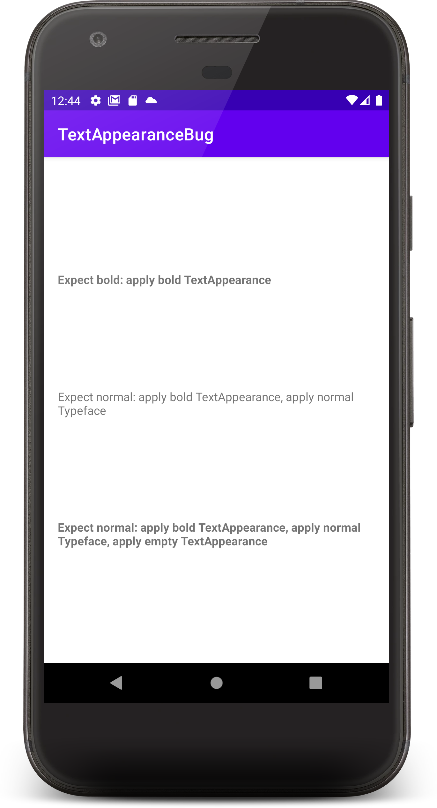

TextAppearance bug reproduction project
=======================================

This project reproduces a bug with applying `TextAppearance` and `Typeface` programmatically.

Summary:
-------
`setTextAppearance()` with no `textStyle` attribute may make you lose the text style previously set with `setTypeFace()`, if you previously set a `TextAppearance` with a `textStyle`.

Example:

Styles:
```xml
<style name="TextAppearanceBold">
    <item name="android:textStyle">bold</item>
</style>

<style name="TextAppearanceEmpty" />
```

Applying styles as `TextAppearance` and `Typeface` in code:
```kotlin
tv.setTextApperance(R.style.TextAppearanceBold)
// yay, we're bold 👍
tv.setTypeface(null, Typeface.NORMAL)
// yay, we're normal 👍
tv.setTextApperance(R.style.TextAppearanceEmpty)
// we're bold again! 🤯 
```


Possible explanation?
---------------------
The second `setTextApperance()` call will revert the style back to bold. You can follow this logic in
```
AppCompatTextView.setTextAppearance() 
 -> AppCompatTextHelper.onSetTextAppearance() 
  -> AppCompatTextHelper.updateTypefaceAndStyle()
```

The first thing `updateTypefaceAndStyle()` does is:
```java
mStyle = a.getInt(R.styleable.TextAppearance_android_textStyle, mStyle);
```

which resets the style back to the one from the previous `TextAppearance` (the one with bold). 

To reproduce the issue
======================
* Build this app: `./gradlew assembleDebug`
* Install it on a device
* Expected behavior:
  - text 1 is bold
  - text 2 is normal
  - text 3 is normal
* Actual behavior:
  - text 1 is bold
  - text 2 is normal
  - text 3 is bold




